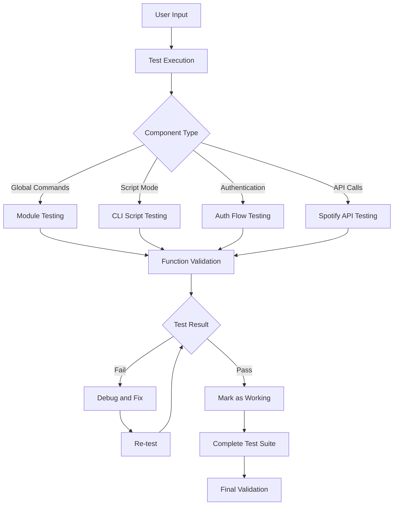

# Spotify CLI Testing and Debugging Design

## Overview

This design document outlines the systematic approach to test, debug, and fix all Spotify CLI functionality. The current implementation has multiple broken features that need to be identified and resolved through comprehensive testing and targeted fixes.

## Architecture

### Current System Components

1. **Main CLI Script** (`spotifyCLI.ps1`)

   - Interactive CLI mode with `/` prefixed commands
   - Authentication handling
   - Core command processing

2. **PowerShell Module** (`SpotifyModule.psm1`)

   - Global commands available anywhere in PowerShell
   - Function exports and aliases
   - Cross-session functionality

3. **Installation System** (`Install-SpotifyCliDependencies.ps1`)

   - Module installation and profile configuration
   - Dependency management
   - Global command setup

4. **Configuration System**
   - Token storage (`%APPDATA%\SpotifyCLI\tokens.json`)
   - User settings (`%APPDATA%\SpotifyCLI\config.json`)
   - Environment variables (`.env` file)

### Testing Architecture



## Components and Interfaces

### 1. Authentication Component

**Interface:**

- Input: Spotify Client ID/Secret from `.env`
- Output: Valid access tokens stored locally
- Error Handling: Clear messages for missing credentials, network issues, auth failures

**Testing Strategy:**

- Verify `.env` file loading
- Test initial authentication flow
- Test token refresh mechanism
- Test error scenarios (invalid credentials, network issues)

### 2. Spotify Application Launcher

**Interface:**

- Command: `spotify`
- Action: Launch Spotify desktop application
- Fallbacks: Windows Store version, error guidance

**Testing Strategy:**

- Test with Spotify not installed
- Test with Spotify already running
- Test different installation paths
- Verify success/failure messages

### 3. Current Track Display System

**Interface:**

- Commands: `plays-now`, `music`, `pn`, `Show-SpotifyTrack`, `sp`
- Output: Formatted track information with progress bars
- Modes: Detailed and compact display

**Testing Strategy:**

- Test with music playing
- Test with podcast playing
- Test with no active playback
- Test all command aliases
- Verify formatting and colors

### 4. Playback Control System

**Interface:**

- Commands: `play`, `pause`, `next`, `previous`
- Parameters: Track numbers for smart playback
- Requirements: Active Spotify device, Premium account for some features

**Testing Strategy:**

- Test basic controls (play/pause/next/previous)
- Test smart number playback (`play 1`)
- Test with no active device
- Test with Free vs Premium accounts
- Verify error messages

### 5. Advanced Controls System

**Interface:**

- Commands: `volume`, `seek`, `shuffle`, `repeat`
- Parameters: Numeric values, on/off states
- Aliases: `vol`, `sh`, `rep`

**Testing Strategy:**

- Test volume control (0-100 range)
- Test seek forward/backward
- Test shuffle on/off
- Test repeat modes (track/context/off)
- Test with Premium/Free accounts

### 6. Device Management System

**Interface:**

- Commands: `devices`, `transfer`
- Smart Numbers: Device selection by number
- Aliases: `tr`

**Testing Strategy:**

- Test device listing
- Test device transfer by number
- Test device transfer by ID
- Test with no available devices
- Verify device information display

### 7. Search and Discovery System

**Interface:**

- Commands: `search`, `search-albums`
- Smart Numbers: Result selection by number
- Interactive Mode: Arrow key navigation

**Testing Strategy:**

- Test music search
- Test podcast search
- Test album-only search
- Test smart number selection
- Test interactive navigation mode
- Test with no results

### 8. Playlist and Library System

**Interface:**

- Commands: `playlists`, `liked`, `recent`, `save-track`, `unsave-track`
- Smart Numbers: Playlist selection
- Playback: `play-playlist`, `queue-playlist`

**Testing Strategy:**

- Test playlist listing
- Test playlist playback by number
- Test specific track from playlist
- Test liked songs display
- Test recent tracks
- Test save/unsave functionality

### 9. Queue Management System

**Interface:**

- Commands: `queue`, `queue clear`, `queue remove`
- Smart Numbers: Track/album queuing
- Aliases: `q`

**Testing Strategy:**

- Test queue display
- Test adding tracks to queue
- Test queue clearing
- Test removing specific tracks
- Test album queuing

### 10. Interactive Navigation System

**Interface:**

- Trigger: Enter key after search results
- Controls: Arrow keys, Enter, Space, Escape, Numbers
- Visual: Highlighted selection

**Testing Strategy:**

- Test entering interactive mode
- Test arrow key navigation
- Test item selection and playback
- Test queuing from interactive mode
- Test exiting interactive mode

### 11. Configuration System

**Interface:**

- Commands: `Get-SpotifyConfig`, `Set-SpotifyConfig`, `notifications`
- Storage: JSON configuration files
- Settings: Display modes, notifications, colors

**Testing Strategy:**

- Test configuration display
- Test setting modifications
- Test notification controls
- Test configuration persistence
- Test default restoration

### 12. Help and Documentation System

**Interface:**

- Commands: `Get-SpotifyHelp`, `help`, `spotify-help`
- Output: Comprehensive command documentation
- Context: Command-specific help

**Testing Strategy:**

- Test general help display
- Test command-specific help
- Test all help aliases
- Verify documentation completeness

### 13. Alias Management System

**Interface:**

- Commands: `Set-SpotifyAlias`, `Get-SpotifyAliases`, `Remove-SpotifyAlias`, `Test-AliasConflicts`
- Functionality: Custom command shortcuts
- Safety: Conflict detection

**Testing Strategy:**

- Test alias creation
- Test alias listing
- Test alias removal
- Test conflict detection
- Test alias persistence

## Data Models

### Token Storage Model

```json
{
  "access_token": "string",
  "token_type": "Bearer",
  "expires_in": 3600,
  "refresh_token": "string",
  "obtained_at": 1234567890,
  "scopes": "space-separated-scopes"
}
```

### Configuration Model

```json
{
  "PreferredDevice": "device_id_or_null",
  "CompactMode": false,
  "NotificationsEnabled": true,
  "AutoRefreshInterval": 0,
  "Colors": {
    "Playing": "Green",
    "Paused": "Yellow",
    "Track": "Cyan",
    "Artist": "Yellow",
    "Album": "Green",
    "Progress": "Magenta"
  },
  "Aliases": {
    "music": "Show-SpotifyTrack",
    "vol": "volume"
  }
}
```

### Session State Model

```powershell
$script:SessionDevices = @()      # Array of device objects with smart numbers
$script:SessionTracks = @()       # Array of track/episode objects from search
$script:SessionPlaylists = @()    # Array of playlist objects
$script:SessionAlbums = @()       # Array of album objects
$script:InteractiveMode = $false  # Boolean for navigation mode
$script:SelectedIndex = 0         # Current selection in interactive mode
```

## Error Handling

### Error Categories and Responses

1. **Authentication Errors (401)**

   - Clear message about expired session
   - Automatic re-authentication attempt
   - Guidance for manual re-auth if needed

2. **Permission Errors (403)**

   - Explanation of Premium requirements
   - List of affected features
   - List of available features for Free accounts

3. **Device Errors (404)**

   - Guidance to start Spotify on any device
   - Instructions to activate a device
   - Device listing command suggestion

4. **Rate Limiting (429)**

   - Automatic retry with backoff
   - User notification of temporary delay
   - Guidance to reduce request frequency

5. **Network Errors**

   - Connection troubleshooting steps
   - Retry mechanisms
   - Offline mode limitations

6. **Configuration Errors**
   - Missing .env file guidance
   - Invalid credential detection
   - Default configuration restoration

## Testing Strategy

### Phase 1: Component Isolation Testing

Test each component individually to identify broken functionality:

1. **Authentication Flow**

   - Test with valid credentials
   - Test with invalid credentials
   - Test token refresh
   - Test error scenarios

2. **Basic Commands**

   - Test each command individually
   - Verify expected outputs
   - Check error handling

3. **API Integration**
   - Test API endpoint connectivity
   - Verify request/response handling
   - Check error code processing

### Phase 2: Integration Testing

Test component interactions:

1. **Command Chaining**

   - Search → Play workflow
   - Device → Transfer workflow
   - Playlist → Play workflow

2. **State Management**

   - Smart number persistence
   - Session state handling
   - Configuration persistence

3. **Cross-Mode Testing**
   - Global commands vs Script mode
   - Interactive vs Direct commands
   - Alias vs Full commands

### Phase 3: User Experience Testing

Test complete user workflows:

1. **First-Time User**

   - Installation process
   - Initial authentication
   - Basic usage tutorial

2. **Power User**

   - Advanced features
   - Customization options
   - Efficiency workflows

3. **Error Recovery**
   - Network interruptions
   - Authentication failures
   - Device disconnections

### Phase 4: Cross-Platform Testing

Test on different environments:

1. **PowerShell Versions**

   - Windows PowerShell 5.1
   - PowerShell 7+

2. **Terminal Types**

   - Windows Terminal
   - VS Code Terminal
   - PowerShell ISE
   - Command Prompt

3. **Account Types**
   - Spotify Premium
   - Spotify Free
   - Different regions

## Implementation Plan

### Step 1: Diagnostic Framework

Create comprehensive diagnostic tools to identify current issues:

- System environment detection
- Spotify API connectivity testing
- Authentication status verification
- Module loading validation

### Step 2: Systematic Testing

Execute test plan with user interaction:

- Test each requirement systematically
- Document failures and error messages
- Identify root causes
- Prioritize fixes by impact

### Step 3: Targeted Fixes

Fix identified issues one by one:

- Authentication system repairs
- API integration fixes
- Command routing corrections
- Error handling improvements

### Step 4: Integration Validation

Verify fixes work together:

- End-to-end workflow testing
- Cross-component interaction validation
- Performance and reliability testing

### Step 5: Documentation and Cleanup

Finalize the working system:

- Update documentation
- Clean up debug code
- Optimize performance
- Prepare for deployment

## Success Criteria

The testing and debugging phase will be considered complete when:

1. **All Requirements Pass**: Every acceptance criteria from the requirements document is met
2. **Error Handling Works**: All error scenarios produce helpful, actionable messages
3. **Cross-Platform Compatibility**: System works on all supported PowerShell environments
4. **Performance Acceptable**: Commands respond within reasonable time limits
5. **User Experience Smooth**: Complete workflows can be executed without confusion
6. **Documentation Accurate**: All features work as described in README.md

## Risk Mitigation

### Potential Issues and Solutions

1. **Spotify API Changes**

   - Risk: API endpoints or authentication may have changed
   - Mitigation: Test against current Spotify Web API documentation

2. **PowerShell Environment Variations**

   - Risk: Different PowerShell versions may behave differently
   - Mitigation: Test on multiple environments, use compatible syntax

3. **User Account Limitations**

   - Risk: Free accounts have limited API access
   - Mitigation: Clear documentation of Premium requirements

4. **Network and Firewall Issues**

   - Risk: Corporate networks may block Spotify API
   - Mitigation: Clear error messages and troubleshooting guidance

5. **Module Loading Conflicts**
   - Risk: Other PowerShell modules may conflict
   - Mitigation: Proper module isolation and conflict detection

This design provides a comprehensive framework for systematically testing and fixing all Spotify CLI functionality to ensure a reliable, user-friendly experience.
