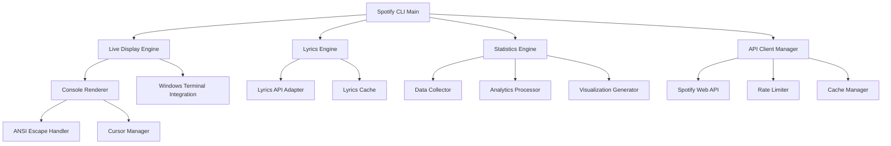

# Design Document - Spotify Live Features

## Overview

This design document outlines the architecture and implementation approach for three major enhancements to the Spotify CLI: Real-time Animation & Live Display, Lyrics Display, and Listening Statistics & Analytics. The design emphasizes performance, user experience, and seamless integration with existing PowerShell workflows.

## Architecture

### High-Level Architecture



### Core Components

#### 1. Live Display Engine

- **Purpose**: Manages real-time display updates and terminal manipulation
- **Key Features**:
  - Non-blocking background updates
  - Multiple display modes (live, sidecar, minimal)
  - Efficient screen rendering using ANSI escape codes
  - Windows Terminal split-pane integration

#### 2. Lyrics Engine

- **Purpose**: Fetches, caches, and displays song lyrics
- **Key Features**:
  - Multi-provider API integration (Genius, Musixmatch)
  - Local caching system
  - Synchronized lyrics highlighting
  - Scrollable text interface

#### 3. Statistics Engine

- **Purpose**: Collects, analyzes, and visualizes listening data
- **Key Features**:
  - Historical data tracking
  - Pattern analysis and trend detection
  - ASCII-based data visualization
  - Export functionality

## Components and Interfaces

### Live Display Engine

#### Console Renderer Interface

```powershell
class ConsoleRenderer {
    [void] InitializeLiveMode()
    [void] UpdateProgressBar([int]$percentage, [string]$track)
    [void] UpdateTrackInfo([hashtable]$trackData)
    [void] CleanupAndExit()
    [void] SetDisplayMode([string]$mode)
}
```

#### Windows Terminal Integration

```powershell
class WindowsTerminalIntegrator {
    [bool] IsWindowsTerminal()
    [void] CreateSidecarPane([string]$position, [int]$width)
    [void] SendToPane([string]$content)
    [void] CloseSidecarPane()
}
```

### Lyrics Engine

#### Lyrics API Adapter Interface

```powershell
class LyricsApiAdapter {
    [hashtable] FetchLyrics([string]$artist, [string]$track)
    [bool] HasSyncedLyrics([hashtable]$lyricsData)
    [string] GetCurrentLine([hashtable]$lyricsData, [int]$positionMs)
}
```

#### Lyrics Cache Interface

```powershell
class LyricsCache {
    [void] StoreLyrics([string]$trackId, [hashtable]$lyricsData)
    [hashtable] GetCachedLyrics([string]$trackId)
    [bool] HasCachedLyrics([string]$trackId)
    [void] CleanupOldEntries([int]$maxAgeHours)
}
```

### Statistics Engine

#### Data Collector Interface

```powershell
class DataCollector {
    [void] RecordPlayback([hashtable]$trackData, [datetime]$timestamp)
    [void] RecordSkip([string]$trackId, [int]$positionMs)
    [array] GetPlaybackHistory([datetime]$startDate, [datetime]$endDate)
}
```

#### Analytics Processor Interface

```powershell
class AnalyticsProcessor {
    [hashtable] GetTopTracks([string]$period, [int]$limit)
    [hashtable] GetTopArtists([string]$period, [int]$limit)
    [hashtable] GetGenreDistribution([string]$period)
    [hashtable] GetListeningPatterns([string]$period)
}
```

## Data Models

### Track Data Model

```powershell
class TrackData {
    [string] $Id
    [string] $Name
    [string] $Artist
    [string] $Album
    [int] $DurationMs
    [int] $PositionMs
    [bool] $IsPlaying
    [string] $AlbumArtUrl
    [array] $Genres
    [datetime] $PlayedAt
}
```

### Lyrics Data Model

```powershell
class LyricsData {
    [string] $TrackId
    [string] $FullText
    [array] $SyncedLines  # Array of [timestamp, text] pairs
    [string] $Source      # "genius", "musixmatch", etc.
    [datetime] $CachedAt
    [bool] $HasSyncedLyrics
}
```

### Statistics Data Model

```powershell
class ListeningStats {
    [hashtable] $TopTracks
    [hashtable] $TopArtists
    [hashtable] $TopAlbums
    [hashtable] $GenreDistribution
    [hashtable] $DailyPatterns
    [hashtable] $WeeklyPatterns
    [int] $TotalPlaytime
    [int] $CurrentStreak
    [datetime] $PeriodStart
    [datetime] $PeriodEnd
}
```

## Error Handling

### API Error Handling Strategy

1. **Rate Limiting**: Implement exponential backoff with jitter
2. **Network Errors**: Graceful degradation to cached data
3. **Authentication Errors**: Clear error messages with re-auth instructions
4. **Service Unavailable**: Fallback to basic functionality

### Error Recovery Patterns

```powershell
class ErrorHandler {
    [hashtable] HandleApiError([System.Exception]$error) {
        switch ($error.GetType().Name) {
            "HttpRequestException" {
                return @{ Action = "Retry"; Delay = 2000 }
            }
            "UnauthorizedAccessException" {
                return @{ Action = "Reauth"; Message = "Please re-authenticate" }
            }
            "RateLimitException" {
                return @{ Action = "Backoff"; Delay = 60000 }
            }
            default {
                return @{ Action = "Fallback"; Message = $error.Message }
            }
        }
    }
}
```

### Terminal State Management

- Save cursor position before live mode
- Restore terminal settings on exit
- Handle Ctrl+C gracefully
- Clean up background threads

## Testing Strategy

### Unit Testing Approach

1. **Mock API Responses**: Test with simulated Spotify API data
2. **Console Output Testing**: Verify ANSI escape sequences and formatting
3. **Cache Testing**: Validate data persistence and retrieval
4. **Statistics Calculations**: Test analytics algorithms with known datasets

### Integration Testing

1. **End-to-End Workflows**: Test complete user scenarios
2. **Windows Terminal Integration**: Verify split-pane functionality
3. **API Integration**: Test with real Spotify API (rate-limited)
4. **Performance Testing**: Measure CPU and memory usage during live mode

### Test Data Management

```powershell
class TestDataProvider {
    [hashtable] GetMockTrackData()
    [hashtable] GetMockLyricsData()
    [array] GetMockPlaybackHistory()
    [hashtable] GetMockSpotifyApiResponse()
}
```

## Performance Considerations

### Live Display Optimization

1. **Differential Updates**: Only redraw changed screen regions
2. **Efficient String Building**: Use StringBuilder for complex formatting
3. **Background Threading**: Non-blocking updates using PowerShell runspaces
4. **Memory Management**: Proper disposal of resources and event handlers

### Caching Strategy

1. **Lyrics Cache**: 30-day retention with LRU eviction
2. **API Response Cache**: 1-minute cache for current track data
3. **Statistics Cache**: Daily aggregation cache for performance
4. **Memory Limits**: Maximum 50MB cache size with automatic cleanup

### API Rate Management

```powershell
class RateLimiter {
    [datetime] $LastRequest
    [int] $RequestCount
    [int] $MaxRequestsPerMinute = 60

    [bool] CanMakeRequest() {
        # Implementation of rate limiting logic
    }

    [void] RecordRequest() {
        # Track request timing
    }
}
```

## Security Considerations

### API Key Management

- Store tokens securely using Windows Credential Manager
- Implement token refresh logic
- Never log sensitive authentication data

### Data Privacy

- Local storage only for statistics and cache
- User consent for data collection
- Option to clear all stored data

### Input Validation

- Sanitize all user inputs
- Validate API responses before processing
- Prevent injection attacks in command parsing

## Implementation Phases

### Phase 1: Core Live Display (Week 1-2)

- Basic live mode functionality
- Progress bar updates
- Terminal state management
- ANSI escape code implementation

### Phase 2: Advanced Display Features (Week 3-4)

- Sidecar mode for Windows Terminal
- Multiple display modes
- Performance optimization
- Error handling

### Phase 3: Lyrics Integration (Week 5-6)

- Lyrics API integration
- Caching system
- Scrollable display
- Synchronized highlighting

### Phase 4: Statistics Engine (Week 7-8)

- Data collection framework
- Analytics processing
- ASCII visualization
- Export functionality

### Phase 5: Polish and Testing (Week 9-10)

- Comprehensive testing
- Performance tuning
- Documentation
- User feedback integration

## Configuration Options

### User Configuration Schema

```json
{
  "liveDisplay": {
    "refreshInterval": 1000,
    "displayMode": "detailed",
    "sidecarPosition": "right",
    "sidecarWidth": 40,
    "showAlbumArt": true,
    "colorScheme": "auto"
  },
  "lyrics": {
    "preferredProvider": "genius",
    "cacheEnabled": true,
    "syncHighlighting": true,
    "scrollSpeed": 3
  },
  "statistics": {
    "trackingEnabled": true,
    "retentionDays": 365,
    "exportFormat": "json",
    "defaultPeriod": "month"
  }
}
```

This design provides a solid foundation for implementing the three core features while maintaining extensibility and performance. The modular architecture allows for independent development and testing of each component while ensuring they work together seamlessly.
